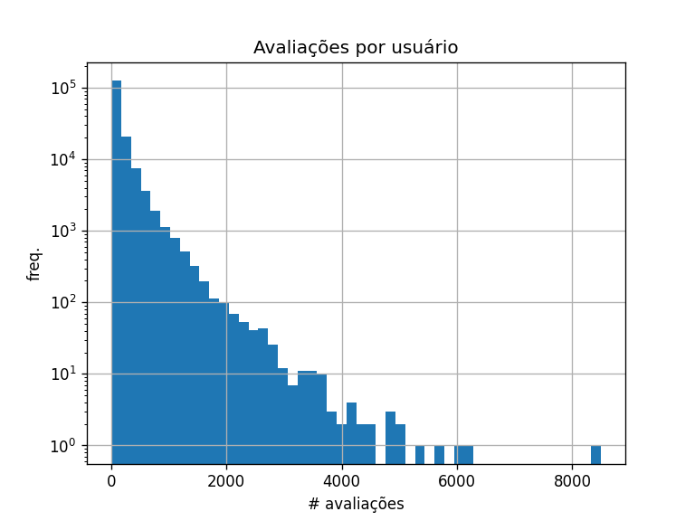
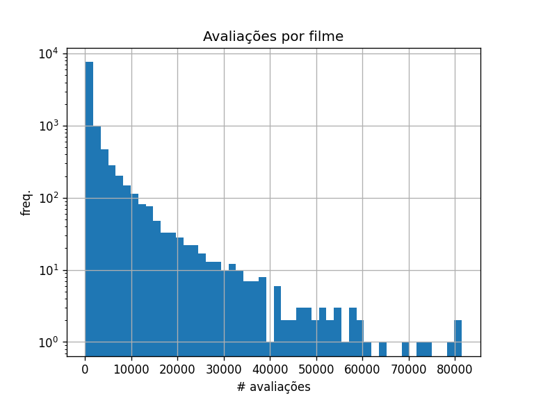
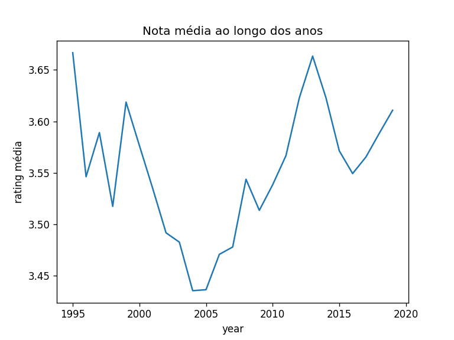
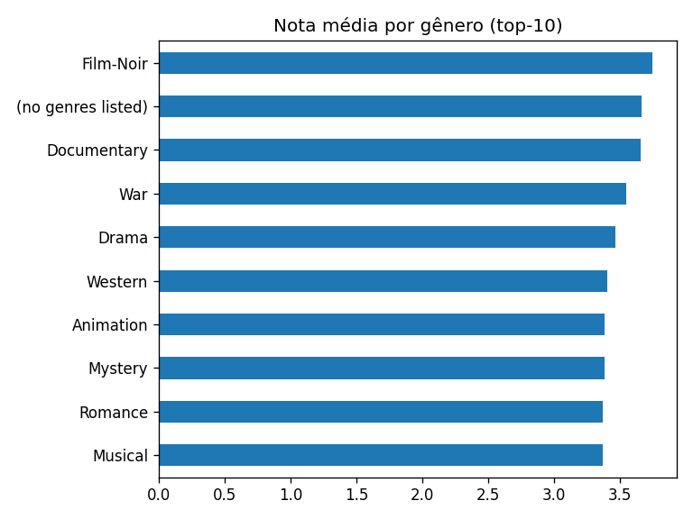

# Sistema de Recomendação de Filmes 🎬

> **Disciplina:** Data Science  
> **Autores:**  
> • Miguel Giacomelli Righi (190947)  
> • Carlos Eduardo Rosa Batista (193570)  
> • Gabriel Rodrigues de Lara Junqueira (179846)  
> **Repositório:** <https://github.com/mrighi9/data-science-project>  
> **Dataset:** [MovieLens 25M](https://grouplens.org/datasets/movielens/)

---

Obs: tanto os arquivos .csv's quanto o modelo de KNN excedem o limite de 100 MB por arquivo do GitHub. Para manter o repositório enxuto e facilitar o clone, hospedamos os mesmos em um link externo: https://drive.google.com/drive/folders/1tehJnQhrOUHx2kZopEA8rA3RXCma0BJm?usp=sharing

## 0. Estrutura de Pastas

```text
.
├── data/
│   ├── raw/               # arquivos originais do MovieLens
│   └── processed/         # movies_clean.csv / ratings_clean.csv
├── notebooks/             # EDA, modelos
│   └── figures/           # gráficos salvos
├── src/                   # scripts reutilizáveis
├── models/                # knn_item.pkl
├── deploy/                # script CLI de predição
└── README.md


````

---

## 1. Dataset e Transformações

| Arquivo original                    | Variáveis principais                         |
| ----------------------------------- | -------------------------------------------- |
| `movies.csv`                        | `movieId`, `title`, `genres` (pipe-separado) |
| `ratings.csv`                       | `userId`, `movieId`, `rating`, `timestamp`   |
| `tags.csv`, `links.csv`, `genome-*` | não usados neste MVP                         |

Transformações em `src/preprocess.py`

* Filtro: **≥ 100 avaliações** por filme (10 326 itens restantes).
* `genres` → lista (`genres_list`) → **one-hot** de 18 gêneros (colunas `Action`, `Drama`, …).
* `avg_rating` por filme (usada na EDA).
* Geração de `movies_clean.csv` e `ratings_clean.csv`.

---

## 2. Pipeline de Dados

| Fase                | Script / Notebook                       | Descrição                                    |
| ------------------- | --------------------------------------- | -------------------------------------------- |
| Acquire & Clean     | `src/preprocess.py`                     | Filtro + one-hot + export.                   |
| EDA                 | `notebooks/1_EDA.ipynb`                 | Métricas, gráficos e hipóteses.              |
| Modelo colaborativo | `notebooks/2_Modelo_Colaborativo.ipynb` | KNN item-based, salva `models/knn_item.pkl`. |
| Modelo conteúdo     | `notebooks/3_Modelo_Conteudo.ipynb`     | TF-IDF + gêneros, matriz cosseno.            |
| Deploy              | `deploy/predict_knn.py`                 | CLI Top-N usando modelo salvo.               |

---

## 3. Análise Exploratória

| Métrica                | Valor      |
| ---------------------- | ---------- |
| Usuários               | 162 540    |
| Filmes (≥ 100 ratings) | 10 326     |
| Avaliações             | 24 443 380 |
| Sparsidade             | 98.54 %    |

<p align="center">
  
  
</p>

* **Long-tail**: 70 % dos usuários ≤ 50 avaliações.
* **Tendência anual**: queda 2004–2006, retomada após 2011.

<p align="center">
  
</p>

<p align="center">
  
</p>

### Hipóteses de Negócio

1. Usuários veteranos (> 1000 ratings) tendem a notas menores (3.42 ★ vs 3.55 ★ global).
2. Gêneros **Film-Noir** e **Documentary** são os mais bem avaliados (> 3.65 ★).
3. Após 2010 há retomada da nota média anual.
4. Filmes extremamente populares (> 50 000 ratings) têm +0.2 ★ sobre a média.

---

## 4. Modelos

| Abordagem                      | Configuração                             | Resultado       |
| ------------------------------ | ---------------------------------------- | --------------- |
| **KNN Item-Based (WithMeans)** | `k=50`, cosseno, treino 34 min           | **RMSE 0.8265** |
| **Conteúdo**                   | One-hot gêneros + TF-IDF título, cosseno | Qualitativo ✔   |

Exemplo Conteúdo (`Toy Story (1995)` → 5 mais similares)
`Toy Story 2`, `Toy Story 3`, `Toy Story 4`, `Moana`, `Shrek the Third`

---

## 5. Como Reproduzir

```bash
git clone https://github.com/mrighi9/data-science-project

cd data-science-project

pip install -r requirements.txt

python deploy/predict_knn.py --user 1 --top 5
```

Saída esperada

```
Top 5 recomendações para usuário 1:
Planet Earth (2006)                           4.48★
Planet Earth II (2016)                        4.46★
The Shawshank Redemption (1994)               4.40★
Band of Brothers (2001)                       4.36★
The Godfather (1972)                          4.32★
```